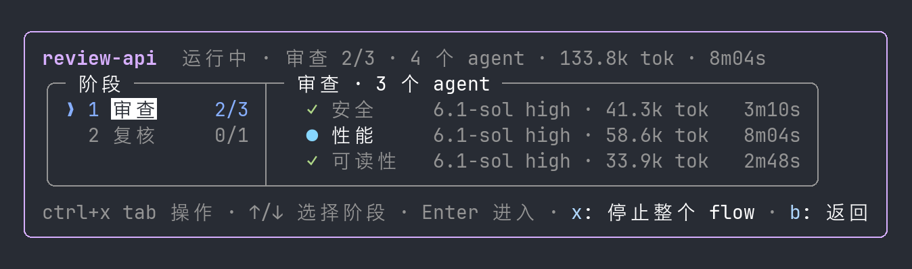
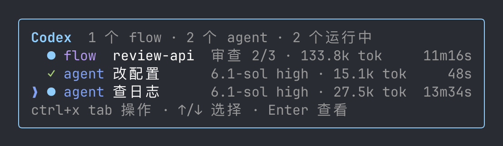
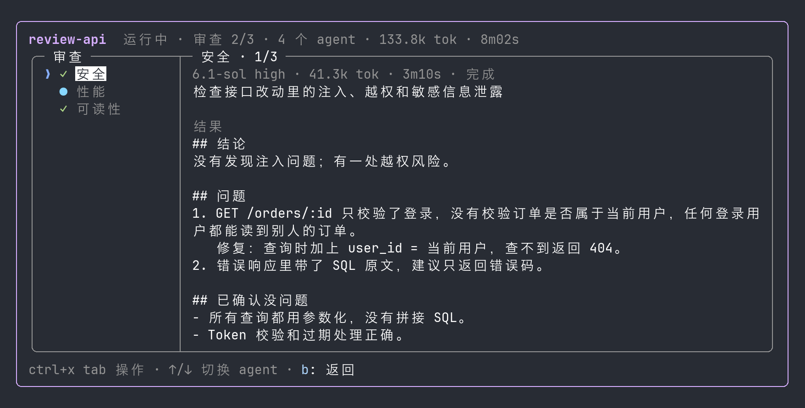

# Codex Flow

中文 | [English](README.en.md)

**在 Claude Code 里像 Workflow 一样派发、查看和停止 Codex 任务。** Claude 把边界清楚的子任务交给 Codex CLI 执行：单个任务用 `run.sh`，多个任务用 `codex-flow` 按阶段并行。进度显示在输入框上方的任务面板里，停止、完成通知和续跑沿用 Claude Code 原生的后台任务。



- **Codex CLI**：OpenAI 的命令行编程智能体，本项目用它执行 Claude 派出的任务。
- **mod**：Claude Code 的插件钩子模块，可以在界面上绘制面板、注册命令。本项目的任务面板是一个 mod。

当前版本：[V0.1.0](https://github.com/Eason412/codex-flow/releases/tag/V0.1.0)。app-server 客户端的协议用法参照 [openai/codex-plugin-cc](https://github.com/openai/codex-plugin-cc)（Apache-2.0）。

> ⚠️ **前提：本机需有已登录的 Codex CLI、Node.js 和支持 mod 的 Claude Code。** Codex 以完全权限运行（无沙箱、不审批），会直接修改文件和执行命令。

## ✨ 特点

- 🧭 **分阶段并行与流水线**：计划文件只写阶段和任务。同一阶段的任务并行，阶段之间默认按顺序；任务写上 `after` 后，前置一完成就开跑，不等同阶段的慢任务。结果用 `{{task:名字}}`、`{{phase:标题}}` 引用，长提示词和共用背景可放进文件，每个任务可在自己的目录运行。
- 📺 **输入框上方的实时面板**：任务开始时面板自动出现，结构参照 Claude Workflow 的详情面板：左栏阶段，右栏 agent，每行显示模型、effort、token 和耗时，逐层进入即可查看结果。
- 🔢 **实时 token 用量**：flow 任务在 Codex 每次回复后更新用量，单个任务每 2 秒从 Codex 会话记录读取；续接或分叉旧对话时只计本次运行。
- ⏹️ **原生停止与完成通知**：flow 由后台 Bash 启动，在 Background 列表按 x 即可停止，结束时自动通知 Claude；单个任务在面板中按 x 停止，`steer` 可向运行中的任务补充指示。
- 🛡️ **写入范围与验收**：任务可声明允许修改的路径和验收命令。结束后执行器核对 Codex 的改文件记录和 git 工作区，标出越界写入，并在任务目录运行验收命令，全部通过才算完成。
- ♻️ **续跑复用结果**：`--resume` 时已完成且提示词未改的任务直接复用结果，只重跑改动的任务和依赖它的任务。结束时的汇总给每个任务附三行以内的结论，多数情况不必再打开结果文件。
- 🔍 **实际模型核实**：报告中的模型和 effort 取自 Codex 自己的会话记录，与请求不一致或无法核实时标出 ⚠。
- ⏱️ **15 分钟排查提醒**：任务每运行满 15 分钟，mod 在对话中提醒 Claude 读取日志并向用户汇报；任务不会被自动停止，也不会只凭时长被判定为卡住。
- 🔒 **模型白名单**：`models.json` 列出允许的模型和 effort，名单外的请求在启动前即被拒绝。
- 📐 **长列表分窗显示**：面板按可用行数分段显示，用「还有 N 个」翻动；查看子代理的对话时，面板让出位置。

## ⚙️ 工作原理

```text
Claude Code 主对话
 ├─ run.sh ─────────────────► codex exec              单个任务
 └─ 后台 Bash: codex-flow ───► codex app-server × N    每个任务一个进程
         │ 两者都写入运行状态
         ▼
 ~/.claude/codex-flow/runs/<runId>/
         │ 读取
         ├─► codex-flow mod    输入框上方的面板、15 分钟提醒
         └─► statusline.mjs    面板收起时状态行中的一行进度
```

| 组成 | 作用 |
| --- | --- |
| `run.sh` | 运行单个 Codex 任务，登记状态并报告实际使用的模型 |
| codex-flow 执行器 | 读取计划、按阶段推进，写入状态、结果和汇总 |
| codex-flow mod | 任务面板、`/flow` 命令、停止单个任务和 15 分钟提醒 |
| `statusline.mjs` | 供 ccstatusline 调用，面板收起时显示一行进度 |
| `SKILL.md` | 告诉 Claude 何时委派、选用哪个模型、如何排查 |
| `models.json` | 允许的模型和 effort |

mod 只负责显示和提醒；mod 未加载时，任务照常运行。运行记录保留 7 天。

## 🖥️ 任务面板

同时有多个任务时一行一个：flow 固定排在单个 agent 上面，同类中新开始的在上；任务结束后位置不变。flow 用紫色，单个 agent 用蓝色，外框颜色随列表中的任务类型变化。运行中的 flow 和阶段前面是闪烁的蓝色星形（与 Claude Code 的 ✻ 指示一致），按依赖提前开跑时几个阶段同时闪烁，标题行写「N 个阶段并行」；运行中的 agent 前面是转圈的蓝色细点阵；阶段一栏依次显示序号、状态、名称、完成数和耗时；标题行左边是名称和状态，右边的总 token 和总时长对齐下方栏位。时长和 token 栏按上限预留宽度，运行变长时版面不跳；高度不够时先省方框，不留残框。



进入 agent 后，右栏显示任务说明和结果，左栏可切换到同阶段的其他 agent。



| 按键 | 作用 |
| --- | --- |
| `ctrl+x tab` 或点击面板 | 把键盘切换到面板 |
| `↑` `↓`（`←` `→`、`Tab` 相同） | 在可选项之间移动 |
| `Enter` | 进入阶段、查看 agent 结果 |
| `b` | 返回上一层 |
| `x` | 停止选中的任务或整个 flow |
| `q` | 关闭面板，任务全部结束后出现 |
| `Esc` | 回到输入框 |
| `ctrl+x ctrl+a` | 展开被 Claude Code 折叠的面板 |

有任务在跑时面板只能折叠、不能关闭；输入 `/flow` 可随时打开面板。全部结束 30 秒后，自动打开的面板自动收起。

## 🚀 设置方法

由 Agent 读取 [SETUP.md](SETUP.md)，按其中步骤完成安装、配置与验收。完成后重新打开 Claude Code 会话，mod 在会话启动时加载。

需用户亲自完成的事项：登录 Codex CLI（`codex login`）。

### 个人设置

| 设置项 | 位置 | 说明 |
| --- | --- | --- |
| 允许的模型和 effort | `models.json` | 名单外的模型和 effort 直接拒绝 |
| 提醒间隔 | `~/.claude/settings.json` 的 `env`：`CODEX_FLOW_ALERT_AFTER` | 单位为秒，默认 900 |
| 运行记录位置 | `~/.claude/settings.json` 的 `env`：`CODEX_FLOW_HOME` | 默认 `~/.claude/codex-flow` |
| 状态行进度 | ccstatusline 的 custom-command | 命令 `node ~/.claude/skills/codex/flow/statusline.mjs`，开启 `preserveColors` |

## 📖 用法

日常使用时，在对话中让 Claude「交给 Codex」，或说明有几个可以并行、分阶段的任务；Claude 按 [SKILL.md](SKILL.md) 选择模型、写计划并在后台启动。命令也可以直接在 Claude Code 会话中运行，面板只显示本会话派出的任务。

```json
{"name": "docs", "cwd": "/path/to/repos",
 "phases": [
   {"title": "撰写", "tasks": [
     {"label": "甲文档", "model": "gpt-6.1-sol", "effort": "high", "cwd": "repo-a", "promptFile": "write-a.md"},
     {"label": "乙文档", "model": "gpt-6.1-sol", "effort": "high", "cwd": "repo-b", "promptFile": "write-b.md"}]},
   {"title": "审查", "tasks": [
     {"label": "甲审查", "model": "gpt-6.1-sol", "effort": "high", "schema": "review", "cwd": "repo-a", "after": ["甲文档"], "prompt": "{{file:review.md}}\n{{task:甲文档}}"},
     {"label": "汇总", "model": "gpt-6-astra", "effort": "high", "prompt": "复核：\n{{phase:撰写}}"}]}]}
```

「甲审查」写了 `after`，「甲文档」完成后立即开始；「汇总」没写，等整个撰写阶段结束。`promptFile` 和 `{{file:}}` 相对计划文件所在目录，任务的 `cwd` 相对计划的 `cwd`。任务还可加 `"writes": ["README.md"]` 限定修改范围、加 `"checks": ["<命令>"]` 指定验收命令。

| 命令 | 作用 |
| --- | --- |
| `run.sh -m <模型> -e <effort> "<任务>"` | 运行单个任务；`-r` 续接、`-f` 分叉、`-w` 使用新 worktree、`-j` 按 schema 返回 |
| `flow/codex-flow.mjs run <plan.json>` | 按计划和任务依赖运行，flow 结束才退出，放在后台 Bash 中启动 |
| `flow/codex-flow.mjs run --resume <runId>` | 续跑，复用已完成的任务 |
| `flow/codex-flow.mjs status [runId]` | 查看本会话的运行记录 |
| `flow/codex-flow.mjs cancel <runId> [任务名]` | 停止整个 flow 或其中一个任务 |
| `flow/codex-flow.mjs steer <runId> <任务名> "<内容>"` | 向运行中的任务补充指示 |
| `flow/codex-flow.mjs watch <runId>` | 有任务运行满提醒时长或 flow 结束时输出一行并退出 |

`.mjs` 命令用 `node` 运行，路径相对于 `~/.claude/skills/codex`。计划字段的完整说明见 [SKILL.md](SKILL.md)。

## 📁 仓库结构

| 路径 | 用途 |
| --- | --- |
| [SETUP.md](SETUP.md) | 面向 Agent 的分步安装手册 |
| [SKILL.md](SKILL.md) | 面向 Claude 的委派、选模型与排查规则 |
| [run.sh](run.sh) | 单个任务入口 |
| [flow/](flow/) | codex-flow 执行器、状态行脚本和测试 |
| [mod/](mod/) | 任务面板 mod 及其测试 |
| [agents/codex-runner.md](agents/codex-runner.md) | 在后台代跑常规任务的 Claude 子代理 |
| [schemas/](schemas/) | 内置的 `review`、`opinion`、`result` 返回格式 |
| [models.json](models.json) | 允许的模型和 effort |

## 🤝 贡献须知

欢迎提交兼容修复、功能改进与文档修订。提交 PR 前请注意：

- **范围**：一个 PR 只解决一个问题，不夹带个人配置或无关的格式调整。
- **测试**：改执行器后运行 `node --test flow/tests/`，改 mod 后运行 `claude plugin validate mod` 和 `claude plugin test mod`。执行器测试使用假 Codex 和临时目录，不调用真实 Codex。
- **信息保护**：提交前检查 diff、日志与截图，去除账号信息、私人路径与任务内容。
